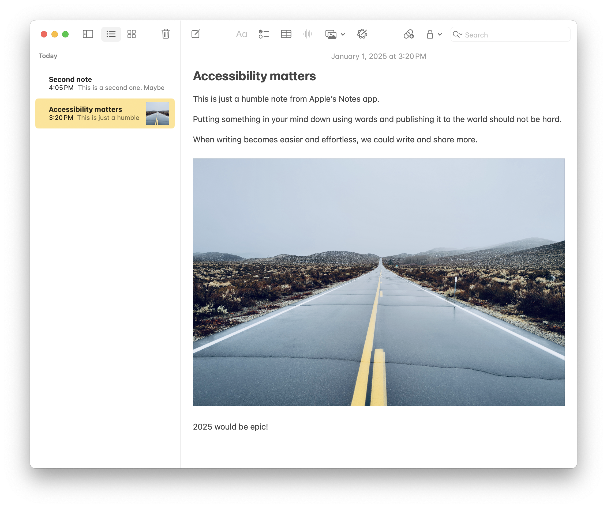
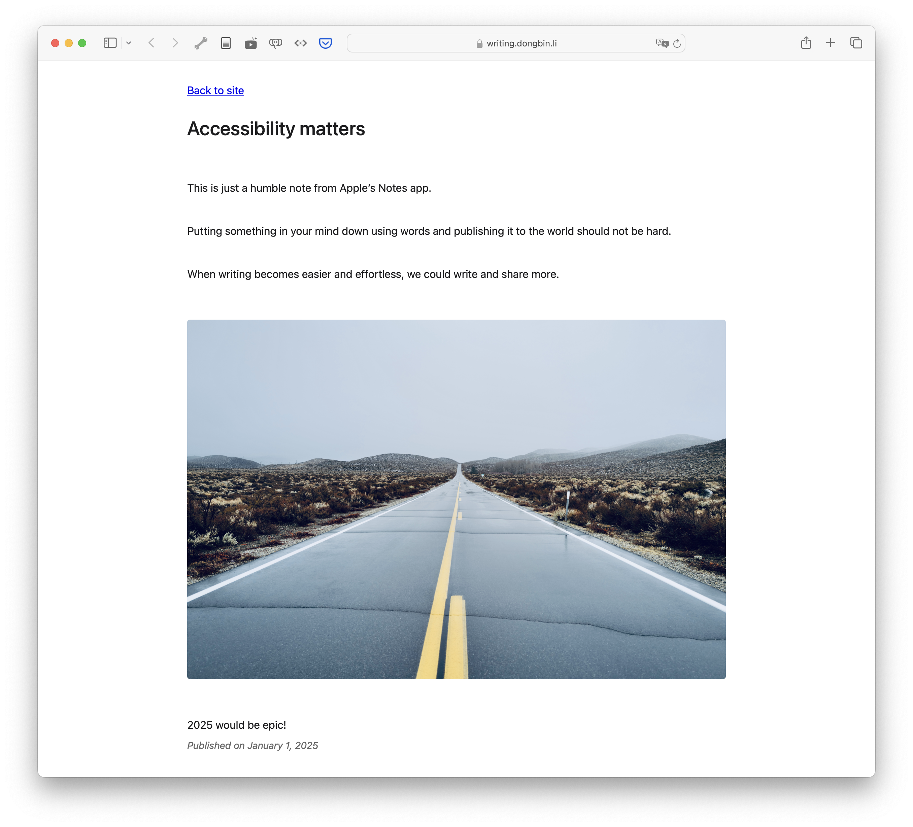

## Turn Apple notes folder to a website

Apple Notes folder:


Generated website:


This is a simple script that turns a folder of your Apple notes into a website.

### Installation
Making sure you have [bun](https://bun.sh/) installed.

```bash
curl -fsSL https://bun.sh/install | bash

# install dependencies
bun install

# build binary
bun run build
```

### Usage

Turn your Apple notes folder into a static website folder.

```bash
# You have an Apple notes folder called 'Writing'
# This will output the static website to '../../writings/a-blog-from-apple-notes'
./bin/generate Writing '../../writings/a-blog-from-apple-notes'
```

This will generate this ready for deploy.

```text
➜ tree ../../writings/a-blog-from-apple-notes
../../writings/a-blog-from-apple-notes
├── Accessibility_matters.html
├── README.md
├── Second_note.html
├── images
│   └── image_d6c0acced5818399125ddbadd0ef788c.jpeg
├── index.html
└── style.css

1 directory, 6 files
```

### Free Github Pages

Once you have the static files, you can easily deploy to Github Pages.
This folder has a simple `publish` script that will help you deploy to Github Pages.

1. Create a new repository `your-name/a-blog-from-apple-notes` on Github
2. Clone the repository to your local machine (example: `~/writings/a-blog-from-apple-notes`)
3. Running `./publish` will deploy the static files to Github Pages

```bash
# publish git repository to Github Pages
./publish ~/writings/a-blog-from-apple-notes
```

### Example site

Here is an example site generated from Apple notes using Github pages (using custom domain):

https://writing.dongbin.li/

### What's next

- [ ] Single binary to simplify installation
- [ ] Generate RSS feeds
- [ ] Allow passing to custom CSS
- [ ] Allow more metadata control on each notes


### FAQ

#### Will this send data anywhere?

No. Everything is done locally by running some AppleScript. It then process the exported JSON, then generate the static files.

#### Why using `bun` instead of NodeJS?

Exported Apple notes HTML uses base64 encoded images. Which could be huge if the image is big (such as `dng` raw format).
For macOS less than 8GB RAM, it crashed a lot. `bun` seems to handle this much better. And a lot faster too.
